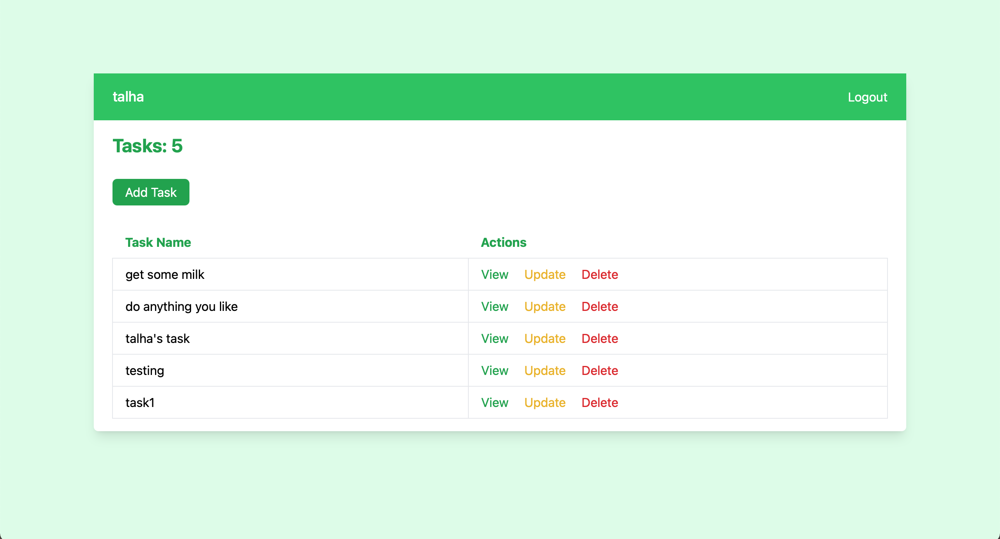
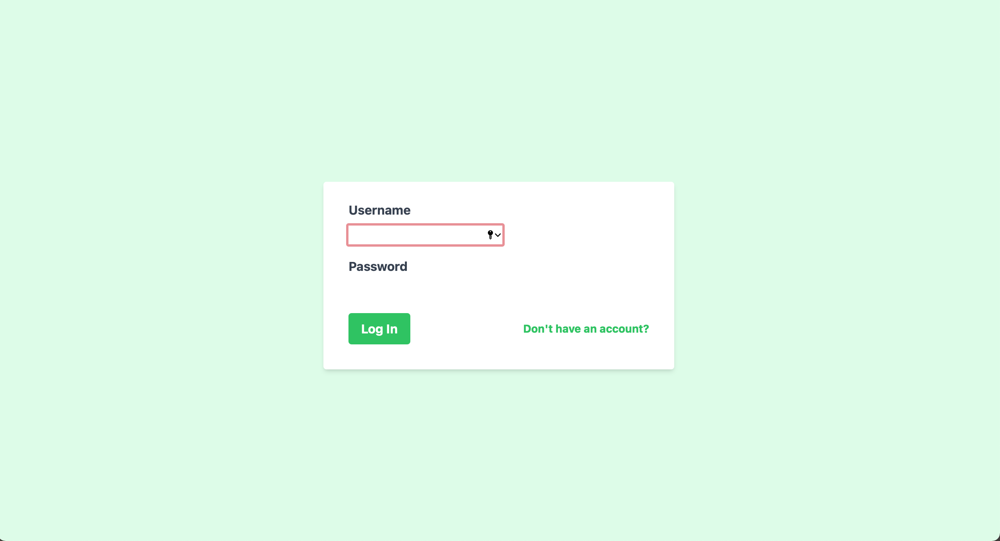

# Todo List Web Application with Django and User Authentication

This is a web application that allows users to create and manage their todo lists. It is built with Django and includes user authentication.

## Features

- User authentication and authorization
- Create, read, update, and delete todo items
- Mark todo items as complete or incomplete
- Search and filter todo items
- Responsive design

## Screenshots




## Installation

1. Clone the repository: git clone https://github.com/yourusername/todo-list-django.git
2. Create a virtual environment: ``` python3 -m venv env ```
3. Activate the virtual environment:``` source env/bin/activate ```
4. Install the requirements:``` pip install -r requirements.txt ```
5. Migrate the database:``` python manage.py migrate ```
6. Create a superuser:``` python manage.py createsuperuser ```
7. Run the server:``` python manage.py runserver ```
8. Access the app in your browser at http://localhost:8000/
